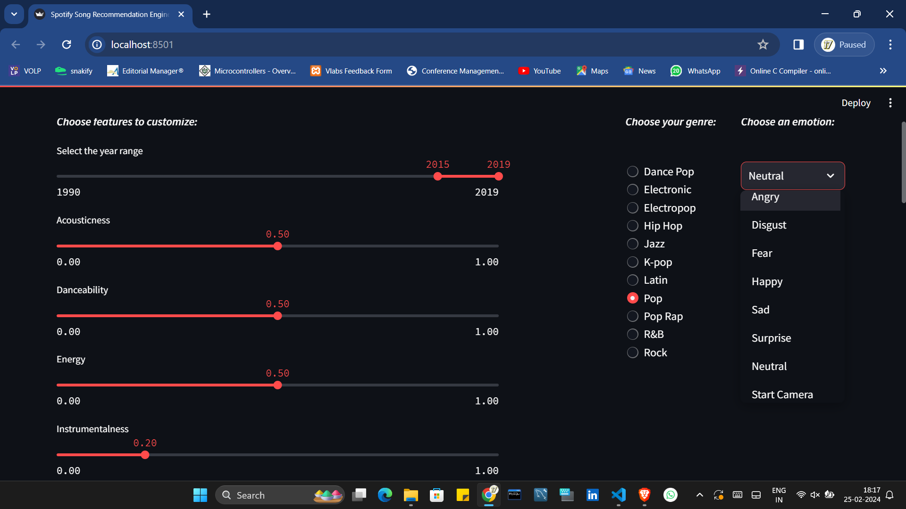

# Emotion Based Music Recommendation System





### Overview
This project implements a Song Recommendation Engine using K-Nearest Neighbors with the Spotify Music Dataset. It combines data from Spotify artists, albums, and tracks to create a comprehensive dataset for analysis and recommendation.

### Features
- Utilizes Spotify Music Dataset
- Implements K-Nearest Neighbors algorithm for recommendation
- Includes face emotion detection using ResNet architecture

### Installation
To get started, clone this repository and install the required packages using pip:

```bash
pip install -r requirements.txt
```

### Usage
To run the application, execute the following command:

```bash
streamlit run app.py
```

### Dataset
The project uses three datasets:
1. Spotify Artists
2. Spotify Albums
3. Spotify Tracks

These datasets are merged to create a new dataset named `filter_track_df`.

### Technologies Used
- Python
- Pandas
- Scikit-learn
- Streamlit
- ResNet

### Contributors
- Mahesh Sathe

### License
This project is licensed under the MIT License. See the [LICENSE](LICENSE) file for details.
```
